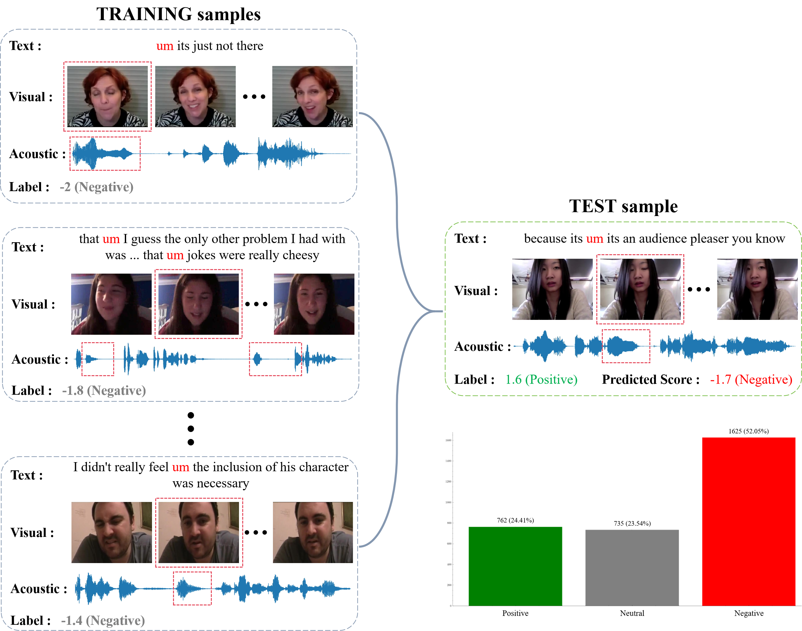

# HQAENet
> **Enhancing the Quality of Multimodal Sentiment Analysis via High-Quality Affect Enhancement Network (AAAI 2026, Submission 21141)**

## Authors' Statement
We encourage open-source and reproducibility work in the AI community and will not set any obstacles to reproducing the performance claimed in our work. However, we strongly oppose any academic misconduct related to plagiarism or theft of our work.

## Overview



In this work, we propose the High-Quality Affect Enhancement Network (**HQAENet**) to suppress the non-sentiment confounding noise shown in the figure above, thereby enhancing the quality of Multimodal Sentiment Analysis (MSA). 

Specifically, we make the following three contributions:

- First observe the negative effect of cross-modal non-sentiment confounding noise on MSA, and reveal its co-causal structure and the masking effect by analyzing the Sentiment Cues Chain.
- Based on the backdoor adjustment theory, we propose HQAENet, which suppresses the propagation of non-sentiment confounding noise in the Sentiment Cues Chain, and improve the Adversarial Reconstruction Network to mitigate the modal confusion problem.
- Experiments on three datasets show that the proposed HQAENet can significantly improve the performance of existing baselines, and achieve SOTA performance.

The **Sentiment Cues Chain** shown below is one of the key contributions of this work:


## Prerequisites
* `Python 3.8.5`
* `PyTorch 1.8.1`
* `transformers==4.29.0`
* `einops==0.6.0`
* `scikit-learn=1.1.3`
* `pandas==1.5.1`
* `numpy=1.23.4`

Please refer to [requirements.txt](requirements.txt) for more details.


## Data Preparation
- We conduct experiments on three popular MSA datasets, including [CMU-MOSI](https://ieeexplore.ieee.org/abstract/document/7742221/), [CMU-MOSEI](https://aclanthology.org/P18-1208/), and [CH-SIMS](https://aclanthology.org/2020.acl-main.343/).
- Download pre-pocessed dataset features and pre-trained bert checkpoints from [Google Cloud Drive](https://drive.google.com/drive/folders/1E5kojBirtd5VbfHsFp6FYWkQunk73Nsv?usp=sharing) (Credits: [Self-MM](https://github.com/thuiar/Self-MM)).
Assume your data structure to be like this (using `sha1sum` command to verify SHA-1 hash value in the parenthesis):
```
|MMSA
    |MOSI
        |Processed
            |unaligned_50.pkl (5da0b8440fc5a7c3a457859af27458beb993e088)
    |MOSEI
        |Processed
            |unaligned_50.pkl (db3e2cff4d706a88ee156981c2100975513d4610)
    |SIMS
        |Processed
            |unaligned_39.pkl (a00c73e92f66896403c09dbad63e242d5af756f8)
```

- Go to [config/get_data_root.py](config/get_data_root.py) and change the data root to your own path.

- For SIMS, you need to use the following script to generate the normalized version (only normalize audio and visual features).

```
python preprocess/normalize_sims.py
```

## Codes Access

To protect the originality of our work, we have open-sourced the code in Anonymous GitHub repository: 

## Evaluation

- #### **CMU-MOSI**

Running

```
conda create -n HQAENet python==3.8.5 -y
conda activate HQAENet
pip install -r requirements.txt
python run_once.py --datasetName "mosi" --do_evaluation True --modelName gqa_net
```
Result


- #### **CMU-MOSEI**

Running

```
conda create -n HQAENet python==3.8.5 -y
conda activate HQAENet
pip install -r requirements.txt
python run_once.py --datasetName "mosei" --do_evaluation True --modelName gqa_net
```
Result


- #### **CH-SIMS**

Running

```
conda create -n HQAENet python==3.8.5 -y
conda activate HQAENet
pip install -r requirements.txt
python run_once.py --datasetName "sims" --do_evaluation True --modelName gqa_net
```

Result


## Training

- #### CMU-MOSI

```
conda create -n HQAENet python==3.8.5 -y
conda activate HQAENet
pip install -r requirements.txt
python run_once.py --datasetName "mosi" --do_evaluation False --modelName gqa_net --[option]
```

- #### CMU-MOSEI

```
conda create -n HQAENet python==3.8.5 -y
conda activate HQAENet
pip install -r requirements.txt
python run_once.py --datasetName "mosei" --do_evaluation False --modelName gqa_net --[option]
```

- #### CH-SIMS

```
conda create -n HQAENet python==3.8.5 -y
conda activate HQAENet
pip install -r requirements.txt
python run_once.py --datasetName "sims" --do_evaluation False --modelName gqa_net --[option]
```

`[option] usage: run_once.py [-h] [--need_task_scheduling NEED_TASK_SCHEDULING][--need_data_aligned NEED_DATA_ALIGNED]` `[--need_model_aligned NEED_MODEL_ALIGNED] [--is_tune IS_TUNE] [--train_mode TRAIN_MODE] [--modelName MODELNAME] [--datasetName DATASETNAME] [--num_workers NUM_WORKERS] [--model_save_dir MODEL_SAVE_DIR] [--res_save_dir RES_SAVE_DIR] [--gpu_ids GPU_IDS]`  `[--missing_rates MISSING_RATES [MISSING_RATES ...]] [--batch_size BATCH_SIZE] [--def_epoch DEF_EPOCH] [--early_stop EARLY_STOP] [--do_evaluation DO_EVALUATION] [--seed SEED] [--num_seeds NUM_SEEDS] [--num_heads NUM_HEADS] [--num_groups NUM_GROUPS] [--num_layer NUM_LAYER] [--exp_name EXP_NAME] [--diff_missing DIFF_MISSING [DIFF_MISSING ...]] [--KeyEval KEYEVAL] [--save_model] [--use_normalized_data]`

